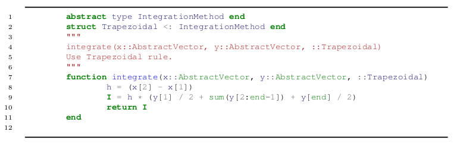
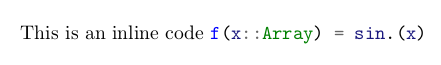

# JuliaTEX
## Introduction 
I've been searching for how to typeset  Julia in TEX files, the problem is that package  Minted doesn't work for custom defined and many standard julia types. I found a solution based on extending a local lexer with the new types.  
## Steps	
Instead of installing the lexer in your Pygments installation, you can keep the lexer with your TeX documents.	

####  If your lexer file is named "jl.py" and the class is "Julia1Lexer", put jl.py in the same directory as your main TeX source file
#### Specify the language in minted with
	 ```latex
	 \begin{minted}{jl.py:Julia1Lexer -x}
	code
	 \end{minted}
	 ```
###
```latex
\usepackage{minted} 
\newcommand{\jlinline}[1]{\mintinline{jl.py:Julia1Lexer -x}{#1}}

\newminted[julia]{jl.py:Julia1Lexer -x}{frame=lines,framerule=1pt,linenos,fontfamily=courier,framesep=2mm,fontsize=\scriptsize,xleftmargin=21pt}
```
```latex
\begin{jl}
	abstract type IntegrationMethod end
	struct Trapezoidal <: IntegrationMethod end
	"""
	integrate(x::AbstractVector, y::AbstractVector, ::Trapezoidal)
	Use Trapezoidal rule.
	"""
	function integrate(x::AbstractVector, y::AbstractVector, ::Trapezoidal)
		h = (x[2] - x[1])
		I = h * (y[1] / 2 + sum(y[2:end-1]) + y[end] / 2)
		return I
	end	
\end{jl}
```


```latex
This is an inline code \jlinline{f(x::Array) = sin.(x)}
```

